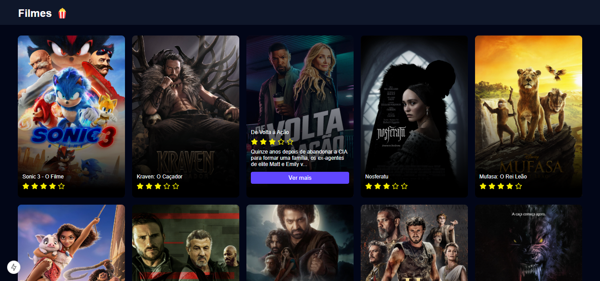
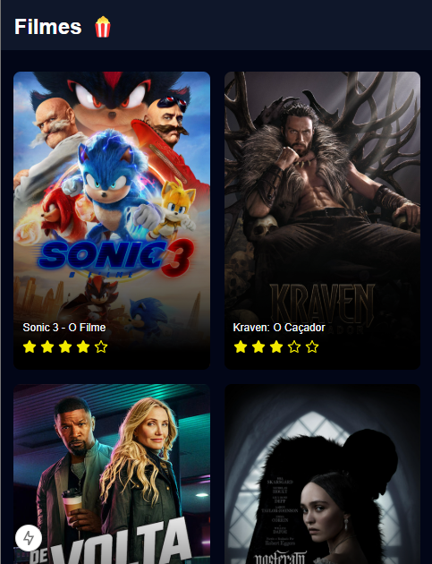

<h1 align="center">
  MovieList
</h1>

  


## 💻 Projeto

O **MovieList** é um projeto desenvolvido para demonstrar a integração com uma **API de filmes** e exibição das informações de filmes em uma interface responsiva. O projeto utiliza **React** com **TypeScript**, **Axios** para requisições à API e **Sass** para estilização.

## 🚀 Tecnologias

- React
- TypeScript
- Axios
- Sass

## 📔 Conhecimentos abordados

- [x] Consumo de API utilizando **Axios**
- [x] Criação de componentes reutilizáveis em **React** com **TypeScript**
- [x] Estilização responsiva com **Sass**
- [x] Exibição de informações dinâmicas de filmes (título, descrição, imagem, etc.)

## 📺 Finalidade

Este projeto tem como objetivo demonstrar como consumir dados de uma API e exibir informações de forma dinâmica em uma interface de usuário. O projeto serve como exemplo de boas práticas de desenvolvimento utilizando **React**, **TypeScript** e **Axios**, com foco em uma boa organização e estruturação de componentes.

## 📲 Projeto Responsivo
Projeto desenvolvido com princípios de responsividade. Tela em dispositivos móveis:

  


## 🛠 Como rodar o projeto

1. Clone o repositório:
   ```bash
   git clone https://github.com/seu-usuario/nome-do-repositorio.git


2. Navegue até a pasta do projeto:

bash
Copiar
Editar
cd nome-do-repositorio


3. Instale as dependências:

bash
Copiar
Editar
npm install


4. Execute o projeto localmente:

bash
Copiar
Editar
npm start

5. Acesse no navegador:

arduino
Copiar
Editar
http://localhost:3000

📬 Contato
Em caso de dúvidas ou sugestões, entre em contato:

Email: devgabrielsilveira@gmail.com <br>
LinkedIn: https://www.linkedin.com/in/gabriel-silveira-67979b18a/ <br>
<b>Desenvolvido por Gabriel Silveira</b> 🚀
